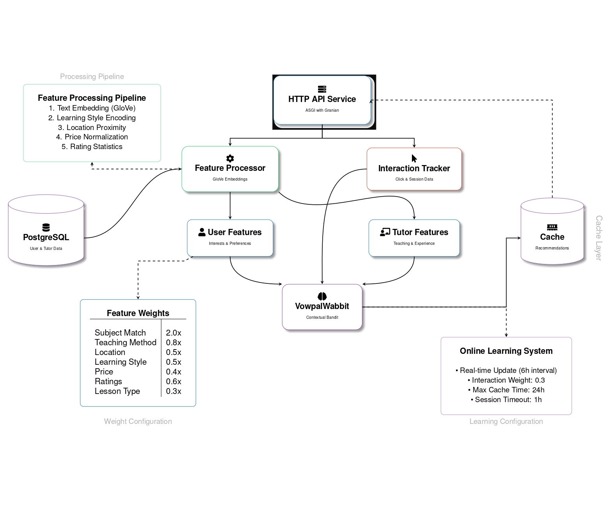

# Tutortoise Recommender System



A real-time recommendation system (Online Learning) for tutories based on user interactions and preferences. The system uses a hybrid approach combining collaborative filtering, content-based filtering, and location-based matching to provide personalized recommendations.

## Features

- Real-time recommendation updates based on user interactions
- Text similarity using GloVe embeddings
- Location-based matching
- Learning style compatibility
- Dynamic price and rating considerations
- High-performance ASGI server with Granian

## Environment Variables

```env
# Database Settings
POSTGRES_USER=postgres
POSTGRES_PASSWORD=postgres
POSTGRES_DB=postgres
POSTGRES_HOST=localhost
POSTGRES_PORT=5432

# Service Settings
SERVICE_PORT=8000
SERVICE_HOST=0.0.0.0

# Model Settings
MODEL_UPDATE_INTERVAL=21600  # Model update interval in seconds
INTERACTION_WEIGHT=0.3       # Weight for user interactions
CLEANUP_INTERVAL=3600       # Cleanup interval for old interactions in seconds

# Granian Server Settings
GRANIAN_HOST=0.0.0.0
GRANIAN_PORT=8000
GRANIAN_INTERFACE=asgi
GRANIAN_WORKERS_PER_CORE=2
GRANIAN_MAX_WORKERS=4
GRANIAN_MIN_WORKERS=2
GRANIAN_HTTP=auto
GRANIAN_BACKLOG=1024
GRANIAN_LOG_LEVEL=info
GRANIAN_LOG_ACCESS_ENABLED=true
GRANIAN_THREADING_MODE=workers
GRANIAN_LOOP=auto
GRANIAN_HTTP1_KEEP_ALIVE=true
```

## API Endpoints

### GET /recommendations/{learner_id}

Get personalized recommendations for a user.

- Query Parameters:
  - `top_k` (int, default=5): Number of recommendations to return
  - `strict` (bool, default=false): Whether to require exact number of recommendations

### GET /interaction/{learner_id}/{tutories_id}

Track user interaction with a tutory.

### POST /model/update

Manually trigger model update.

### POST /model/reset

Reset model state and clear caches.

### GET /model/status

Get current model status and statistics.

### GET /health

Check service health status.

## Running with Docker

Build:

```bash
docker build -t recommender:latest .
```

Run:

```bash
docker run -d \
  --name recommender \
  -p 8000:8000 \
  -e POSTGRES_HOST=host.docker.internal \
  -e POSTGRES_PORT=5432 \
  -e POSTGRES_USER=postgres \
  -e POSTGRES_PASSWORD=postgres \
  -e POSTGRES_DB=postgres \
  -e GRANIAN_WORKERS_PER_CORE=2 \
  -e GRANIAN_MAX_WORKERS=4 \
  -e GRANIAN_LOG_LEVEL=info \
  recommender:latest
```

## Server Configuration

### Workers

The number of workers is calculated based on:

- Workers per CPU core (`GRANIAN_WORKERS_PER_CORE`)
- Maximum workers (`GRANIAN_MAX_WORKERS`)
- Minimum workers (`GRANIAN_MIN_WORKERS`)

Formula: `min(max(CPU_CORES * WORKERS_PER_CORE, MIN_WORKERS), MAX_WORKERS)`

### Performance Tuning

- `GRANIAN_BACKLOG`: Connection queue size (default: 1024)
- `GRANIAN_THREADING_MODE`: Worker threading mode (default: workers)
- `GRANIAN_LOOP`: Event loop implementation (default: auto)
- `GRANIAN_HTTP`: HTTP version (auto, h11, h2)

## Dependencies

- FastAPI
- VowpalWabbit
- Granian
- PostgreSQL (asyncpg)
- NumPy
- GloVe embeddings (Manually converted to NumPy format)
