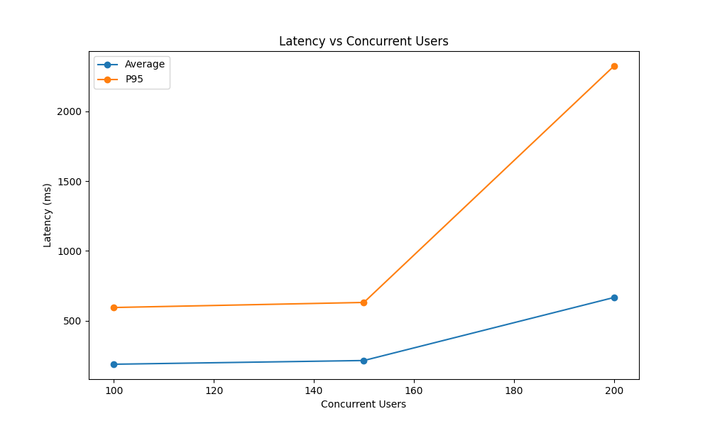

# Low Latency, Medium Throughput System Recommendation Service

it's a poc how to build a low latency, medium throughput system recommendation service using Content-based filtering using cosine similarity between user and mentor embeddings.

everything pre-configured using [uv](https://docs.astral.sh/uv/), just run `uv sync` and `uv granian recommender.main:app --host 0.0.0.0 --port 8000 --interface asgi --workers {number_of_workers}` to start the service.

TODO:
- [ ] Building the Docker Images based on best practices of UV ([this](https://docs.astral.sh/uv/guides/integration/docker/#intermediate-layers))