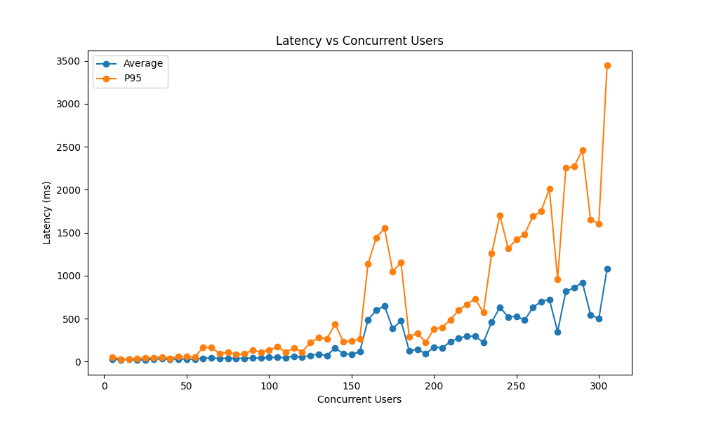

# Low Latency, Medium Throughput System Recommendation Service

it's a poc how to build a low latency, medium throughput system recommendation service using Content-based filtering using cosine similarity between user and mentor embeddings.

